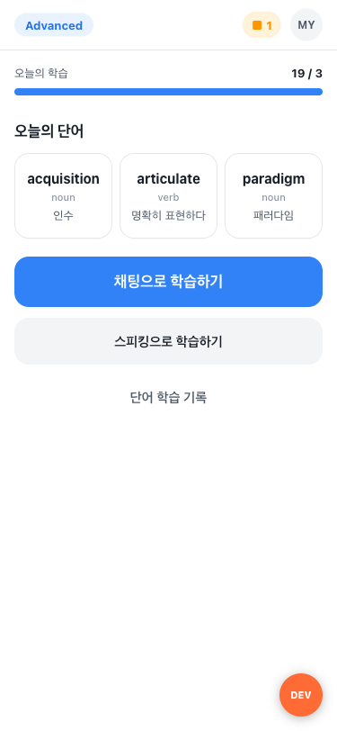
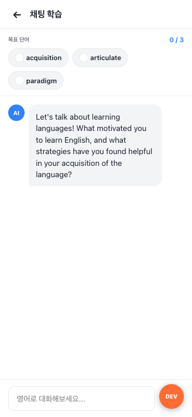
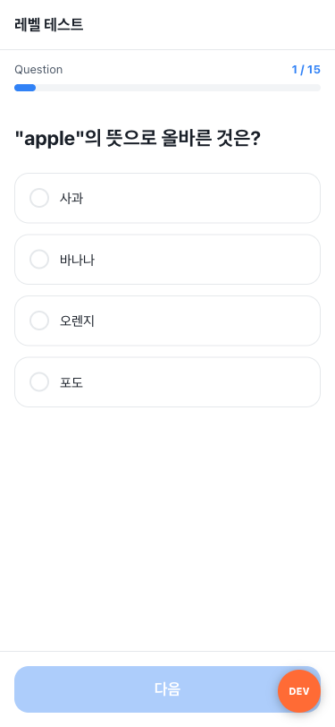
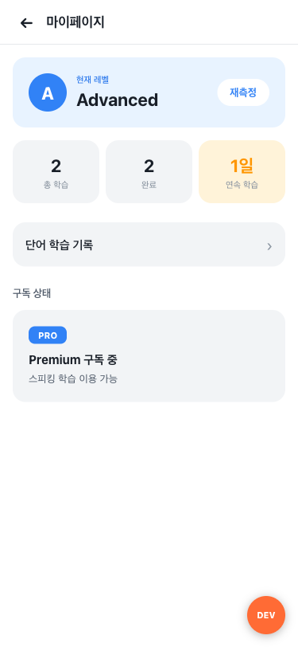
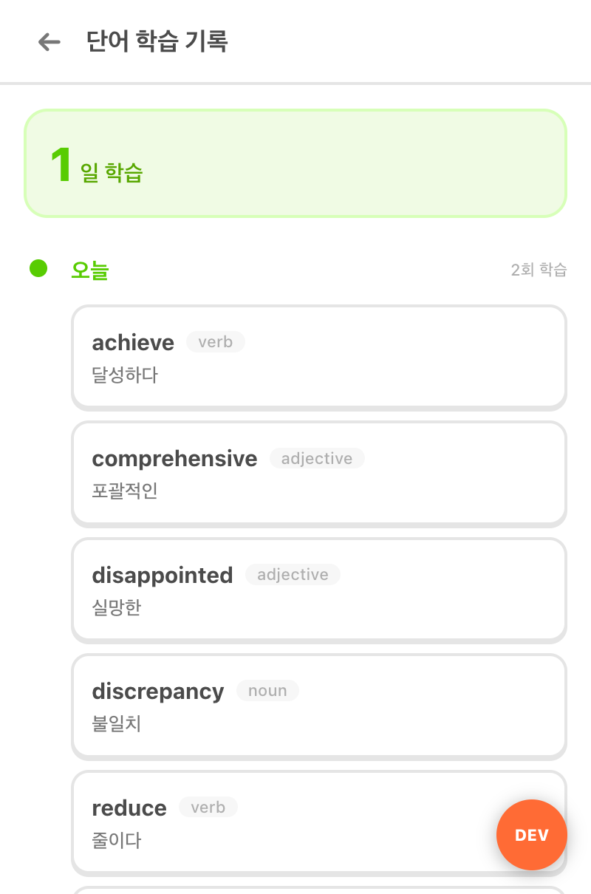
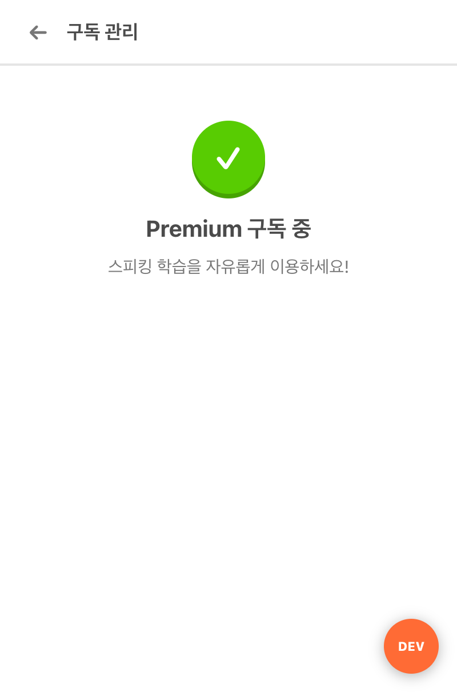

# TokingToking (토킹토킹)

**AI 영어 어휘 학습 앱** - 토스 미니앱 (Apps in Toss)

매일 새로운 영어 단어를 AI 대화를 통해 자연스럽게 학습하는 서비스입니다.

---

## 화면 미리보기

### 홈 화면
오늘의 추천 단어 확인, 학습 진행률, 연속 학습일 표시



### 채팅 학습
AI와 영어 대화하며 목표 단어를 자연스럽게 사용



### 레벨 테스트
15문항 레벨 테스트로 실력에 맞는 학습 제공



### 마이페이지
학습 통계, 연속 학습일, 구독 상태 확인



### 단어 학습 기록
날짜별 학습한 단어를 타임라인으로 확인



### 구독 관리
프리미엄 기능 안내 및 구독 관리



---

## 주요 기능

| 기능 | 설명 | 대상 |
|------|------|------|
| 레벨 테스트 | 15문항 테스트로 초급/중급/고급 자동 배정 | 전체 |
| 채팅 학습 | 3개 단어를 대화 속에서 자연스럽게 사용하도록 AI가 유도 | 무료 |
| 스피킹 학습 | 음성 입력 + Groq Whisper 전사 + AI 발음/문법 피드백 | Premium |
| 오늘의 단어 | 레벨에 맞는 단어 매일 추천 (날짜별 캐싱) | 전체 |
| 학습 기록 | 날짜별 학습 단어 타임라인, 연속 학습일, 통계 | 전체 |
| 무료 사용 제한 | 1일 3회 세션 제한, 초과 시 Premium 안내 | 무료 |

---

## 기술 스택

| 영역 | 기술 |
|------|------|
| Frontend | Vite + React 18 + TypeScript |
| Backend | Python FastAPI |
| Database | Supabase (PostgreSQL) |
| AI (Chat) | OpenAI gpt-4o-mini |
| AI (Speaking) | OpenAI gpt-4o |
| STT | Groq Whisper Large v3 Turbo |
| TTS | Web Speech API |
| State | Zustand |
| Payment | Apps in Toss IAP |

---

## 시작하기

### 1. 환경 변수 설정

```bash
# Backend
cp backend/.env.example backend/.env
# .env 파일에 실제 키 입력

# Frontend
cp frontend/.env.local.example frontend/.env.local
```

### 2. Backend 실행

```bash
cd backend
pip install -r requirements.txt
uvicorn main:app --reload --port 8000
```

### 3. DB 마이그레이션 & 시드

```bash
# Supabase SQL Editor에서 실행:
# backend/db/migrations/001_initial_schema.sql

# 시드 데이터 삽입:
cd backend
python -m db.seed
```

### 4. Frontend 실행

```bash
cd frontend
npm install
npm run dev
```

http://localhost:5173 에서 확인

---

## 프로젝트 구조

```
tokingtoking/
├── backend/
│   ├── main.py                    # FastAPI 앱 진입점
│   ├── config.py                  # 환경 변수 설정
│   ├── db/
│   │   ├── supabase_client.py
│   │   ├── seed.py                # 시드 데이터 스크립트
│   │   └── migrations/            # SQL 스키마
│   ├── middleware/
│   │   ├── auth.py                # JWT 인증
│   │   └── premium.py             # 프리미엄 검증
│   ├── models/                    # Pydantic 모델
│   ├── routers/                   # API 라우터
│   │   ├── auth.py                # 인증 (토스 로그인)
│   │   ├── chat.py                # 채팅 학습
│   │   ├── speaking.py            # 스피킹 학습
│   │   ├── vocab.py               # 어휘 관리
│   │   ├── level_test.py          # 레벨 테스트
│   │   ├── history.py             # 학습 기록 + 단어 히스토리
│   │   ├── iap.py                 # 인앱 결제
│   │   └── health.py              # 헬스 체크
│   ├── services/                  # 비즈니스 로직
│   │   ├── chat_service.py        # AI 대화 핵심 로직
│   │   ├── transcription_service.py # Groq Whisper STT
│   │   └── vocab_service.py       # 어휘 추천
│   └── prompts/                   # AI 시스템 프롬프트
├── frontend/
│   ├── src/
│   │   ├── pages/                 # 페이지 컴포넌트
│   │   │   ├── index.tsx          # 홈
│   │   │   ├── chat.tsx           # 채팅 학습
│   │   │   ├── speaking.tsx       # 스피킹 학습
│   │   │   ├── level-test.tsx     # 레벨 테스트
│   │   │   ├── session-result.tsx # 세션 결과
│   │   │   ├── mypage.tsx         # 마이페이지
│   │   │   ├── word-history.tsx   # 단어 학습 기록
│   │   │   └── subscribe.tsx      # 구독 관리
│   │   ├── components/            # 재사용 컴포넌트
│   │   ├── services/              # API 클라이언트
│   │   ├── store/                 # Zustand 상태 관리
│   │   ├── styles/                # 디자인 시스템
│   │   │   ├── tokens.ts          # 디자인 토큰 (색상, 간격, 폰트)
│   │   │   └── globals.css        # 글로벌 CSS + 애니메이션
│   │   ├── types/                 # TypeScript 타입
│   │   └── utils/                 # 유틸리티 (TTS 등)
│   └── index.html
├── data/seed/                     # 시드 데이터 (어휘 105개, 문제 15개)
└── docs/screenshots/              # 화면 캡처
```

---

## API 엔드포인트

| Method | Path | 설명 |
|--------|------|------|
| POST | `/api/auth/login` | 토스 로그인 |
| GET | `/api/auth/me` | 내 정보 |
| GET | `/api/level-test/questions` | 레벨 테스트 문제 |
| POST | `/api/level-test/submit` | 레벨 테스트 제출 |
| GET | `/api/vocab/random` | 랜덤 단어 조회 |
| POST | `/api/chat/session` | 채팅 세션 시작 |
| POST | `/api/chat/message` | 채팅 메시지 전송 |
| POST | `/api/speaking/message` | 스피킹 메시지 (텍스트) |
| POST | `/api/speaking/transcribe` | 스피킹 음성 전사+응답 |
| POST | `/api/iap/verify` | IAP 구매 검증 |
| GET | `/api/iap/subscription` | 구독 상태 |
| GET | `/api/history/sessions` | 학습 기록 |
| GET | `/api/history/stats` | 학습 통계 |
| GET | `/api/history/word-history` | 날짜별 학습 단어 기록 |
| GET | `/api/health` | 헬스 체크 |

---

## 음성 학습 파이프라인

```
[사용자 음성] → [MediaRecorder 녹음]
    → [Groq Whisper v3 Turbo: <1초 전사]
    → [LLM 후처리: 학습 어휘 기반 교정]
    → [AI 대화 응답 + 발음/문법 피드백]
    → [TTS 재생]
```

---

## 디자인 시스템

토스 디자인 시스템(TDS)을 기반으로 하되, 학습 앱에 필요한 Duolingo 스타일의 gamification 요소를 블렌딩했습니다.

- **Primary**: Toss Blue (#3182f6) - 토스 앱 안에서 자연스러운 주요 액션 색상
- **Learning Accent**: Duolingo Green (#58CC02) - 학습 완료/성공 표시 전용
- **Grey Scale**: TDS 표준 (grey900 #191f28 ~ grey100 #f2f4f6)
- **Typography**: TDS 스케일 (26/22/17/15/13px)
- **카드/버튼**: Flat design - 1px border, 배경색 차이로 구분 (3D shadow 없음)
- **헤더**: 56px 높이, 1px subtle border (토스 패턴)
- **애니메이션**: fadeIn, slideDown, progressFill, bounce 등

---

## 라이선스

MIT
